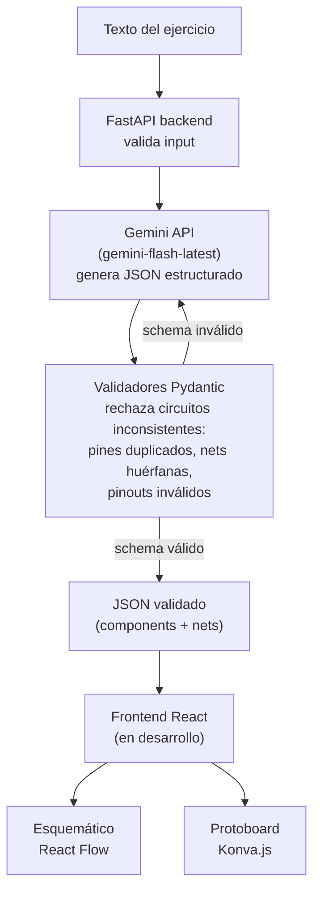

# circuit-ai

Generador de diagramas de circuitos electrónicos a partir de descripciones en lenguaje natural, pensado para estudiantes de Ingeniería en Sistemas / Electrónica sin experiencia previa en hardware.

Dado el enunciado de un ejercicio o práctica de laboratorio, el sistema calcula los componentes necesarios, valida su consistencia eléctrica y genera una representación estructurada (JSON) lista para renderizar como esquemático y como diagrama de protoboard.

## Motivación

Proyecto personal desarrollado para acompañar las prácticas de la materia de Microprocesadores/Sistemas Embebidos (UNIFRANZ, 6to semestre), que incluyen circuitos con microcontroladores PIC16F877A y ESP32, sensores analógicos/digitales, displays LCD I2C, teclados matriciales y actuadores (servos, relés).

## Arquitectura



## Por qué este diseño

El punto crítico del sistema no es la IA en sí, sino el **contrato de datos** entre la IA y el renderer. En vez de dejar que el modelo "invente" nombres de pines o estructuras libres, el backend define:

- Un **schema Pydantic estricto** que la IA debe cumplir (`response_schema` de la API de Gemini), evitando texto libre o markdown.
- Una **tabla fija de pinouts reales** (PIC16F877A, ESP32) contra la que se valida cada asignación de pin — el modelo no puede inventar un pin que no exista físicamente en la placa.
- **Validadores de consistencia eléctrica**: todo pin referenciado en una net debe existir, los ids de pines deben ser únicos en todo el circuito, y los componentes polarizados deben tener nombres de pin coherentes (`ANODE`/`CATHODE`, `VCC`/`GND`).
- Un **reintento automático**: si la IA genera algo que viola el schema, el error de validación se le devuelve como contexto y se le pide corregirlo, antes de fallar la request.

Este enfoque redujo drásticamente los errores de inconsistencia (pines duplicados, nets huérfanas) que aparecían en las primeras iteraciones del proyecto.

## Tech stack

**Backend**
- [FastAPI](https://fastapi.tiangolo.com/) — servidor HTTP async
- [Pydantic v2](https://docs.pydantic.dev/) — validación de schema y reglas de negocio
- [Google Gemini API](https://ai.google.dev/) (`google-genai` SDK) — generación del circuito vía structured output, tier gratuito

**Frontend** *(en desarrollo)*
- React + Vite + TypeScript
- [React Flow](https://reactflow.dev/) — vista esquemática (nodos = componentes, edges = nets)
- [Konva.js](https://konvajs.org/) (`react-konva`) — vista de protoboard interactiva

## Componentes soportados

| Categoría | Tipos |
|---|---|
| Pasivos | `resistor`, `capacitor`, `potentiometer` |
| Fuente/control | `battery`, `switch`, `relay` |
| Salida | `led`, `buzzer`, `servo` |
| Microcontrolador | `microcontroller` (boards: `PIC16F877A`, `ESP32`, con pinout real validado) |
| Periféricos | `lcd_i2c`, `keypad_matrix` |
| Sensores | `sensor_analog` (LM35, LDR), `sensor_digital` (HC-SR04, IR, PIR) |

## Estructura del proyecto
circuit-ai/
├── backend/
│ ├── main.py # Endpoint FastAPI + llamada a Gemini con backoff
│ ├── schema.py # Modelos Pydantic + validadores de consistencia + pinouts
│ ├── system_prompt.py # Prompt de dominio (reglas eléctricas y de pinout)
│ ├── requirements.txt
│ └── .env.example
└── frontend/ # (en desarrollo)
## Instalación

### Requisitos
- Python 3.12+
- Una API key gratuita de Gemini: https://aistudio.google.com/apikey

### Backend

```bash
cd backend
python3 -m venv venv
source venv/bin/activate
pip install -r requirements.txt
cp .env.example .env
# Editá .env y pegá tu GEMINI_API_KEY
uvicorn main:app --reload --port 8000
```

### Probar el endpoint

```bash
curl -X POST http://localhost:8000/generate-circuit \
  -H "Content-Type: application/json" \
  -d '{"text": "Encender un LED rojo con una pila de 9V"}'
```

## Ejemplo de salida

```json
{
  "components": [
    {
      "id": "BAT1",
      "type": "battery",
      "pins": [
        {"id": "BAT1.VCC", "net": "VCC"},
        {"id": "BAT1.GND", "net": "GND"}
      ]
    }
  ],
  "nets": [
    {"id": "VCC", "connected_pins": ["BAT1.VCC", "R1.1"], "color_hint": "red"}
  ],
  "warnings": []
}
```

## Estado del proyecto

- [x] Schema y validadores de consistencia eléctrica
- [x] Integración con Gemini API (structured output + reintento)
- [x] Soporte de microcontroladores (PIC16F877A, ESP32) con pinout real
- [x] Soporte de periféricos y sensores comunes de laboratorio
- [x] Validado contra 5 prácticas reales del semestre
- [ ] Frontend: vista esquemática (React Flow)
- [ ] Frontend: vista de protoboard (Konva)
- [ ] Validaciones eléctricas adicionales (cortos, corrientes excesivas)

## Autor

Anton — Ing. en Sistemas, UNIFRANZ
